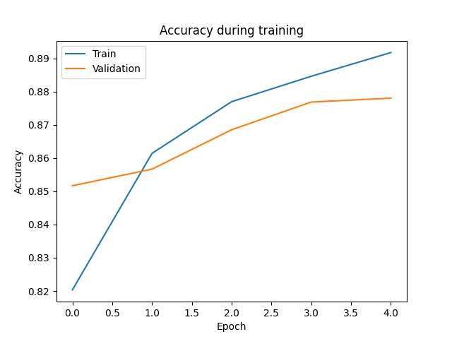

# tutkielma-koneoppiminen-neuroverkot

## Tekijä
- Nimi: Eetu Pärnänen
- Kurssi: Ohjelmistokehityksen teknologioita
- Seminaarityö: Koneoppimistutkielma keskittyen neuroverkkoihin

## Johdanto
Koneoppiminen (machine learning) on modernin tietojenkäsittelyn yksi keskeisimmistä osa-alueista, sitä hyödynnetään useilla eri teknologian osa-alueilla kääntäjäsovelluksista itseajaviin autoihin. Yksinkertaistettuna koneoppimisella tarkoitetaan prosessia, jossa ohjelmistoa koulutetaan datalla tekemään ennustuksia tai luomaan kontenttia yms. Tätä ohjelmistoa kutsutaan malliksi (model).

Viime vuosikymmenen aikana erityisen merkittävään rooliin on noussut keinotekoiset neuroverkot. Nämä neuroverkot ovat mahdollistaneet erilaisia läpimurtoja laajalla skaalalla teknologian osa-alueita, kuten luonnollisen kielen käsittelyssä ja autonomisissa järjestelmissä. Neuroverkot ovat perhe 'malleja' jotka pyrkivät jäljittelemään ihmisaivojen tapaa käsitellä tietoa. 

Tämän seminaarityön tavoite on tarjota selkeä katsaus tai vähintään pintaraapaisu siihen, mitä koneoppimisella tarkoitetaan, mitä neuroverkot ovat ja miten ne toimivat, sekä miten niitä voidaan soveltaa. Tavoitteena ei ole akateemisesti laaja tuotos, vaan pienempi kokonaisuus, joka auttaa ymmärtämään peruskäsitteet ja rakenteet.

## Koneoppimisen perusteet
Koneoppiminen on tekoälyn osa-alue, jossa järjestelmät/ohjelmistot oppivat tekemään päätöksiä, ennusteita tai luomaan datan perusteella ilman, että kaikkia sääntöjä tarvitsee erikseen määritellä ohjelmoimalla. Ideana on, että algoritmi havaitsee datasta toistuvia rakenteita ja oppii mallintamaan niitä, sekä pystyisi tämän pohjalta tekemään yleistyksiä uusiin tilanteisiin.

Koneoppimisen perusajatus voidaan tiivistää karkeasta kolmeen vaiheeseen:

- Data: Algoritmi saa esimerkkejä, kuten erilaisia arvoja, kuvia tai tekstiä.
- Oppiminen: Malli muokkaa sisäisiä parametrejään, jotta sen tekemät ennustukset paremmin vastaisivat opetusdataan.
- Yleistys: Valmis malli pystyy toimimaan myös uudella ja opetusdatan ulkopuolisella aineistolla.

**Oppimisen eri muodot** 
Koneoppiminen voidaan jakaa kolmeen pääluokkaan:

- Ohjattu oppiminen (supervised learning), jonka tavoitteena on ennustaa jotain konkreettista, ja opetusdatasta tiedetään haluttu tulos. Esimerkiksi kuvien luokittelu (onko kuvassa koira vai kissa). 
- Ohjaamaton oppiminen (unsupervised learning), jonka tarkoituksena on löytää rakenteita datasta ilman valmiita vastauksia. Esimerkiksi, erilaisten asiakasryhmien löytäminen datasta. Algoritmi etsii siis samanlaisuuksia.
- Vahvistusoppiminen (reinforcement learning), jossa oppiminen tapahtuu jatkuvassa vuorovaikutuksessa mallin ja ympäristön välillä. Missä malli oppii hiljalleen saamalla 'palkkioita' ja 'rangaistuksia'. Esimerkiksi, pelibotit tai robotiikka.

**Mikä tekee koneoppimisesta tehokasta**
Koneoppimismallit ja erityisesti neuroverkot pystyvät oppimaan monimutkaisia funktioita, joita on äärimmäisen vaikea määritellä käsin. Mallit pystyvät esimerkiksi: Tunnistamaan satojen muuttujien suhteita, yleistämään sotkuisesta ja epätäydellisestä datasta yms. 

## Keinotekoiset neuroverkot
Keinotekoiset neuroverkot (Artificial neural networks, ANN) ovat koneoppimismalleja, jotka on suunniteltu imitoimaan sitä, miten ihmisaivot käsittelevät tietoa. Siinä missä ihmis-aivot hyödyntävät neuroneita datan prosessoinnissa, keinotekoiset neuroverkot käyttävät keinotekoisia neuroneita datan analysointiin, säännönmukaisuuksien tunnistamiseen, sekä ennustamiseen. Ne kykenevät oppimaan monimutkaisia funktioita datasta ja niiden teho perustuu kerrokselliseen rakenteeseen. Neuroverkot toimivat perustana usealle modernille tekoälyn osa-alueelle, kuten kuvantunnistukselle, kielenmallinnukselle ja ohjausjärjestelmille.

### Neuronin rakenne
Kuten mainittu ANN:ät koostuvat keinotekoisista neuroneista, jotka konseptuaalisesti seuraavat biologisia neuroneita. Jokainen näistä neuroneista ottaa vastaan syötteitä, jotka voivat olla ulkoista dataa, tai muiden neuroneiden ulostuloja, ja jokainen neuroni tuottaa yhden ulostulon. Neuroverkon viimeisten ulostuloneuronien arvot on tarkoitus suorittaa mallille annettu tehtävä.

Yhden neuronin laskenta koostuu tyypillisesti seuraavista vaiheista:

- Syötteistä: x1,x2...,xn
- Painot: Jokaisella syötteellä on paino, joka kertoo syötteen merkityksen.
- Painotettu summa.
- Aktivaatio
### Aktivaatiofunktio
Aktivaatiofunktio neuroverkossa on matemaattinen funktio jota sovelletaan neuronin ulostuloon. Se tuo ei-lineaarisuuden neuronin ulostuloon, ilman sitä verkko olisi vain lineaarinen malli, joka ei kykene oppimaan monimutkaisia piirteitä. 

Aktivaatiofunktioita on useita erilaisia, yleisimpiä näistä on:
- Sigmoid: Tuottaa arvon välillä 0-1 ja on hyödyllinen todennäköisyyksien mallintamisessa, mutta altis vanhenemiselle.
- ReLU(Rectified linear unit): Tuottaa arvon 0-∞, eli ulostulo on aina positiivinen arvo. ReLU on yksi yleisimmin käytetyistä aktivaatiofunktioista tehokkuuden vuoksi ja koska se mahdollistaa vastavirta-algoritmin tehostamisen.
- Tanh(hyperbolic activation function): On samankaltainen kuin sigmoid funktio, mutta palauttaa arvon -1 - 1. Sitä käytetään useiten piilokerroksissa, kun tarvitaan laajempaa ulostulo skaalaa.
- Softmax: Kääntää raa'an ulostulon todennäköisyyksiin, joita hyödynnetään moniluokkaisten tunnistus tehtävien parissa.

### Verkkoarkkitehtuuri
Neuroverkot voidaan rakentaa erilaisiksi arkkitehtuureiksi riippuen siitä, millaista dataa käsitellään ja mitä ongelmaa ratkaistaan. Neuroverkot eivät siis koostu vain yksittäisistä neuroneista, vaan ne voidaan jakaa kerroksiin. Yleisesti ottaen nämä kerrokset ovat: Syötekerrros, joka vastaanottaa raakadatan, piilokerros joka suorittaa funktioita ja 'oppii', sekä ulostulokerros joka tuottaa lopullisen vastauksen. Esimerkkejä neuroverkkoarkkitehtuureistaovat muun muassa:

- Feedforward neuroverkot: Nämä ovat yksinkertaisimpia neuroverkkoja, tässä verkossa data kulkee yhteen suuntaan syötekerroksesta ulostulokerrokseen, käyden yhden tai jokaisen piilokerroksen. Data ei tässä arkkitehtuurissa koskaan palaa aikaisemmalle kerrokselle, se ei myöskään hyödynnä vastavirta-algoritmia ja sen pää-käyttötarkoitus on alkeellisissa tunnistus ja regressio tehtävissä.

- Konvoluutioneuroverkot: On suunniteltu prosessoimaan etenkin dataa kuten kuvia. Se sisältää konvoluutiokerroksia jotka lisäävät filttereitä ja oppivat havaitsemaan tärkeitä piirteitä datasta, kuten reunoja ja tekstuureja. Tämä tekee konvoluutioverkoista erityisen tehokkaita visuaalisissa tehtävissä.

- Toistuvat neuroverkot (RNN, recurrent neural networks): On suunniteltu jono ja aikajännedatan, kuten tekstin käsittelyyn. Toisin kuin muissa arkkitehtuureissa toistuvilla neuroverkoilla on takaisinkytkentöjä, jotka sallivat tiedonsiirron takaisin aikaisempiin kerroksiin antaen verkolle 'muistin'. Tämä toiminto auttaa toistuvia verkkoja tekemään ennustuksia perustuen kontekstiin, jonka aikaisempi data on tarjonnut. Tästä johtuen RNN:iä hyödynnetään erityisesti puheentunnistus ja kielimallinnus tehtävissä.

Nämä kategoriat ovat vain osa erilaisita neuroverkkoarkkitehtuureista, mutta ovat mahdollisesti eniten käytettyjä nykypäivänä. 
## Oppimisprosessi
Neuroverkkojen oppimisprosessi perustuu siihen, että verkko etsii painot(weights) ja biassi arvot, jotka tuottavat mahdollisimman hyvät ennusteet annetusta datasta. Oppiminen tapahtuu iteratiivisesti, eli verkko tekee ennusteen x ja vertailee sitä oikeaan vastaukseen, jonka jälkeen se säätää parametrejään päästäkseen lähemmäksi. 
### Kustannusfunktio
Kustannusfunktio (loss function) mittaa sitä, kuinka suuri ero verkon ennusteen ja todellisen tavoite arvon välillä on. Mallin tavoite on minimoida kustannus, eli oppia tekemään mahdollisimman tarkkoja ennusteita. Kustannusfunktioitakin on eri tyyppisiä, syventymättä itse matemaattiseen puoleen sen enempää tässä on lyhyesti kuvailtuna muutama tyypillinen kustannusfunktio:

- MSE, eli mean squared error: On kustannusfunktio, jota käytetään regressiossa ja sen myötä suuret virheet johtavat voimakkaisiin rangaistuksiin. 

- Cross-Entropy-loss: On yleisin luokittelussa, mutta rankaisee myös suurista virheistä vahvasti.

Kustannusfunktio toimii siis ikään kuin oppimisprosessin kompassina ja arvioi mallin tehokkuutta, sekä kertoo onko malli menossa oikeaan suuntaan vai ei.
### Gradientti ja optimointi
Kun kustannusfunktio on määritelty, seuraavaksi tulee löytää 'suunta', minkä mukaan painoja (weights) tulee säätää. Tämä tehdään laskemalla gradientti, eli derivaatat kustannusfunktiosta suhteessa painoihin ja biasseihin. Optimointialgoritmi käyttää gradienttia, jotta painot saadaan päivitettyä. Optimointimenetelmiäkin on useita erilaisia eri tarpeisiin. Oppimisprosessin/optimoijan tehtävä tiivistettynä on löytää paras yhdistelmä painoja ja biasseja, jotka johtavat tarkimpiin ennustuksiin.
### Backpropagation/vastavirta-algoritmi
Backpropagation on keskeinen algoritmi neuroverkkojen koulutuksessa, jossa minimoidaan erotus ennustusten ja todellisten tulosten välillä. Se perustuu ketjusääntöön, ja laskee tarkasti miten jokainen paino ja bias vaikuttaa lopulliseen virheeseen. ALgoritmi skaalautuu myös hyvin monikerroksisiin verkkoihin ja komplekseihi arkkitehtuureihin. Prosessi koostuu kahdesta päävaiheesta jotka ovat:

- Eteenpäinlaskenta (forward pass), missä syötedata lähetetään syötekerrokseen ja se etenee kerros kerrokselta verkon läpi. Jokainen neuroni laskee painotetun summan, soveltaa aktivaatiofunktion ja välittää tuloksen eteenpäin.Jonka jälkeen verkko tuottaa ennusteen ja kustannusfunktio laskee virheen.

- Taaksepäinlaskenta (Backward pass) missä virhe kuljetetaan takaisinpäin verkossa, alkaen ulostulokerroksesta ja edeten kohti sisäänmenoja. Tavoitteena korjata painoja ja biasseja. Taaksepäinlaskenta ei itsessään ole optimointialogitmi, vaan menetelmä gradientin tehokkaaseen laskemiseen. 
### Haasteet ja rajoitteet neuroverkoissa
Vaikka neuroverkot ovat tehokkaita ja monipuolisia menetelmiä, liittyy niihin silti rajoitteita ja haasteita. Ohessa käyn erittelen ja avaan keskeisimpiä näistä haasteista:

- Vaatii suurta määrää dataa: Neuroverkot oppivat parametreja datan avulla, ja koska parametreja voi olla jopa miljoonia, tehokas oppiminen edellyttää yleensä valtavia datasettejä. Liian vähäinen data voi johtaa ylisovittamiseen ja datan kerääminen on kallista ja hidasta tietyissä tapauksissa.

- Ylisovittaminen ja yleistettävyyden puute: Neuroverkko voi oppia liian tarkasti harjoitusdatan yksityiskohtia sen sijaan, että se oppisi yleistettävää rakennetta. Ylisovittaminen on etenkin ongelma, kun data on epätasapainoista. Käänteisesti myös alisovittaminen voi olla ongelma, jos malli on liian yksinkertainen se ei onnistu havaitsemaan syvempää dataa eikä täten suoriudu testi- tai harjoitusdatan parissa.

- Laskennallinen kustannus: Neuroverkot, etenkin syvät verkot vaativat paljon laskentatehoa, muistia ja pitkiä koulutusaikoja. Tämä tekee kehityksestä resurssien kannalta vaativaa ja voi rajoittaa joidenkin sovellusten käyttöä. 

- Selitettävyyden/ymmärryksen puute: Niin sanottu 'Musta-boksi ongelma'. On usein vaikea nähdä tai ymmärtää miten neuroverkko tekee tietyn päätöksen. Mikä hankaloittaa käyttöä aloilla, joissa läpinäkyvyys on välttämätöntä, kuten terveydenhuollossa. 

Muita mahdollisia haasteita ovat muun muassa erilaiset gradienttiongelmat, herkkyys erilaisille häiriöille ja hyökkäyksille yms.

## Testiosuus

### Toteutusympäristö
Testimallin koulutus ja testaus toteutettiin seuraavassa ympäristössä:

- Käyttöjärjestelmä: Windows 11
- Python-versio: 3.12
- Kirjastot: TensorFlow 2.17, Keras, Matplotlib 3
- Data: Fashion-MNIST mikä sisältää 70 000 harmaansävyistä 28x28 kuvaa, ja niistä 10 eri vaatekategoriaa. 60 000 kuvaa käytettiin kouluttamiseen ja 10 000 testaukseen. TensorFlow valitsi automaattisesti CPU-laskennan, joka on riittävä toteutuksen tarpeille.
### Koodirunko
Testi toteutettiin Python tiedostossa train_model.py, joka sisältää melko yksinkertaisen neuroverkkomallin koulutuksen ja arvioinnin. Malli rakentuu seuraavista osista/vaiheista:

- Datan lataus ja esikäsittely: Fashion-MNIST data haetaan suoraan TensorFlown valmiista datasets moduulista ja kuvien pikseliarvot skaalataan välille 0-1 jakamalla ne luvulla 255.

- Arkkitehtuuri: Mallina käytettiin alkeellista syvää neuroverkkoa: 'Flatten' muuttaa 28x28 pikselin kuvat yhdeksi vektoriksi. 'Dense(128, relu)' toimii piilokerroksena ja 'Dense(10, softmax)' tuottaa todennäköisyydet joka luokalle.

- Mallin opettaminen:
Malli koulutettiin näihin asetuksiin:
Optimointialgoritmi Adam, kustannusfunktio sparse categorical crossentropy, epookit 5, validointijoukko 10% opetusaineistosta. Sekä koulutus, että validointitarkkuus tallennettiin kuvaajaa varten.

- Mallin arviointi: Lopuksi mallin suorituskyky arvioidaan erillisellä testidatalla ja testitarkkuus saadaan.

- Tulosten visualisointi:
Koulutuksen tarkkuutta kuvaava käyrä tallennettiin tiedostoon **training_curve.png** jota käytetään alla 'Tulokset' osiossa.
### Tulokset
Mallin koulutus sujui odotetusti ja suorituskyky kehittyi tasaisesti viiden epookin aikana. Lopullinen tarkkuus testidatassa oli 0.8706, mikä tarkoittaa että neuroverkko luokittelee testidatan kuvista noin 87% oikein ilman mitään suurempaa optimointia. Koulutusvaiheen aikana tallennettiin kuvaaja koulutus ja validointidatasta, sekä kuvakaappaus terminaalin epookeista:

Kuvat osoittavat, että koulutus ja validointitarkkuus nousee tasaisesti, eikä ole merkkejä ylisovittamisesta. Tarkoittaen, että malli oppii dataa oikein ja toimii kevyenä demomstraationa neuroverkon toiminnasta.

## Pohdinta ja yhteenveto
Tämän tutkielman tavoite oli tarjota tiivis ja selkeä katsaus koneoppimisen ja erityisesti neuroverkkojen perusteisiin. Keskityimme neuroverkkojen rakenteisiin, oppimisprosessiin, optimointiin, sekä haasteisiin. Työssä tarkoituksella pyrittiin välttämään liiallista teknistä raskautta, sen sijaan keskittyen ydinasioihin ja peruskonseptien valaisemiseen.

Käytännön testiosuudessa toteutettu malli osoitti, miten teoreettiset käsitteet voidaan konkretisoida toimivassa ja yksinkertaisessa neuroverkossa. Vaikka mallia koulutettiin vain vähän, se saavutti varsin hyvän tarkkuuden ja esitteli neuroverkon oppimiskäyttäytymistä.

Kokonaisuutena työ saavutti tavoitteensa, se tarjoaa tiiviin, mutta toimivan kokonaiskuvan koneoppimisesta ja keinotekoisista neuroverkoista. Työ toimii myös hyvänä pohjana niille, ketkä haluavat syventyä aiheeseen pintaraapaisua pidemmälle ja työtä itseään on mahdollista laajentaa myöhemmin.

## Lähteet
- Goodfellow, I., Bengio, Y. & Courville, A. (2016). Deep Learning. MIT Press.

- https://www.geeksforgeeks.org/artificial-intelligence/artificial-neural-networks-and-its-applications/

- https://developers.google.com/machine-learning/crash-course/neural-networks

- MIT Introduction to Deep Learning (course notes) – https://introtodeeplearning.com/

- https://developer.nvidia.com/discover/artificial-neural-network

- TensorFlow Documentation – https://www.tensorflow.org/

- Keras API Documentation – https://keras.io/ 

- Fashion-MNIST Dataset Reference – https://github.com/zalandoresearch/fashion-mnist

- ChatGPT 5 sarjan kielimallia käytetty apuna tekstinmuotoilussa, joidenkin termien suomennoksessa, sekä virheen korjaamisessa tutkielman testiosuuden koodissa.